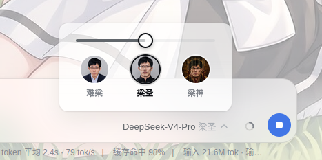

# dsh-client-ui-liang-reasoning

[English](README.md) | [中文](README.zh.md)

Restyles the conversation's thinking-gear selector — three levels
(难梁 / 梁圣 / 梁神) shown as a horizontal slider, each with an icon.
Icons use https://github.com/Lichtspektrum/liang-intensity-calibrator



## Install

```sh
dsh plugin --profile web add github:makuralymi/dsh-webui-liang-gear-position
# without a global dsh:
npx @deepseek-ai/dsh plugin --profile web add github:makuralymi/dsh-webui-liang-gear-position
```

Then restart the web process and refresh the page.

## Customize

- Labels: edit `LABELS` in `lib/client.js`.
- Icons: replace `public/*.png`, then re-inline into `ICONS` in `lib/client.js`.
